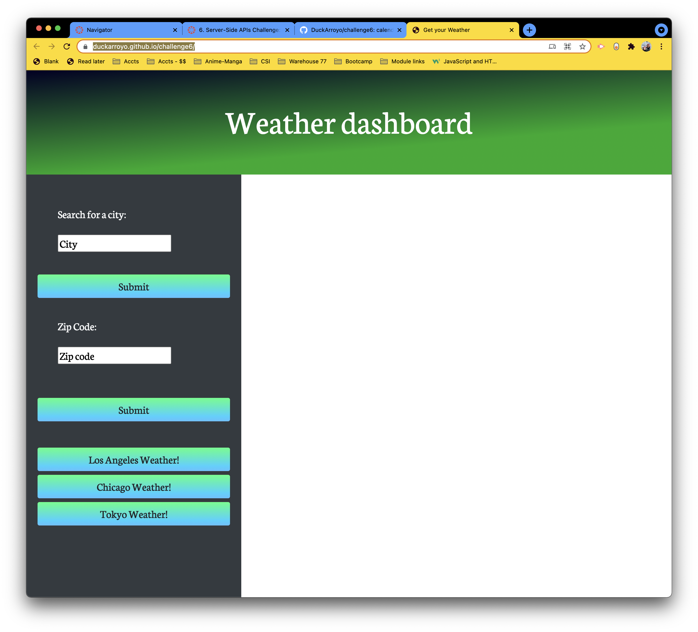
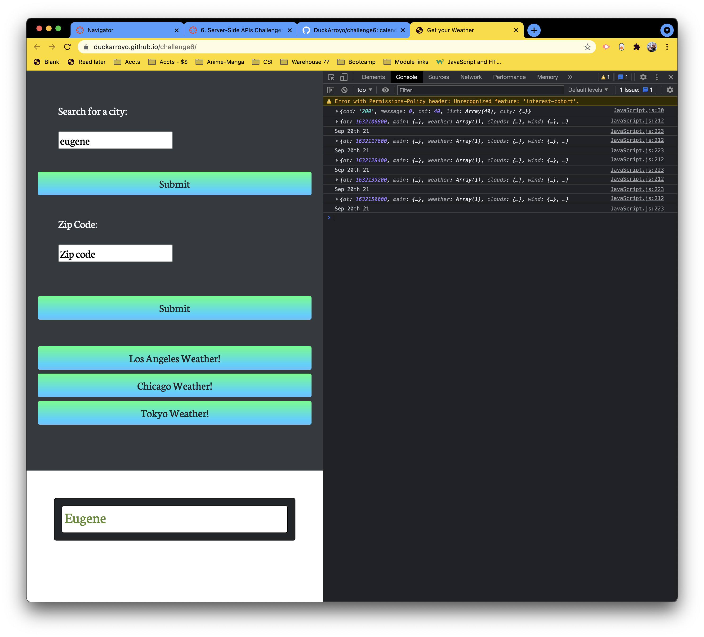

# Weather API 

## UO Coding bootcamp Challenge 6

## Links

Github Pages [Link](https://duckarroyo.github.io/challenge6/)

Github Repository [Link](https://github.com/DuckArroyo/challenge6)

## Description

This application fetches the weather for the searched area. 

## Project Guidelines/Requirements

None

## Required installations for code duplication

None

# Contributions by:

DeveloperDuckArroyo

[Portfolio](https://duckarroyo.github.io/challenge2/)

[GitHub](https://github.com/DuckArroyo)

[Twitter @DevDuckArroyo](https://twitter.com/DevDuckArroyo)

[LinkeIn](https://www.linkedin.com/in/duckarroyo/)

[CodePen](https://codepen.io/DeveloperDuckArroyo)

# Screnshots

